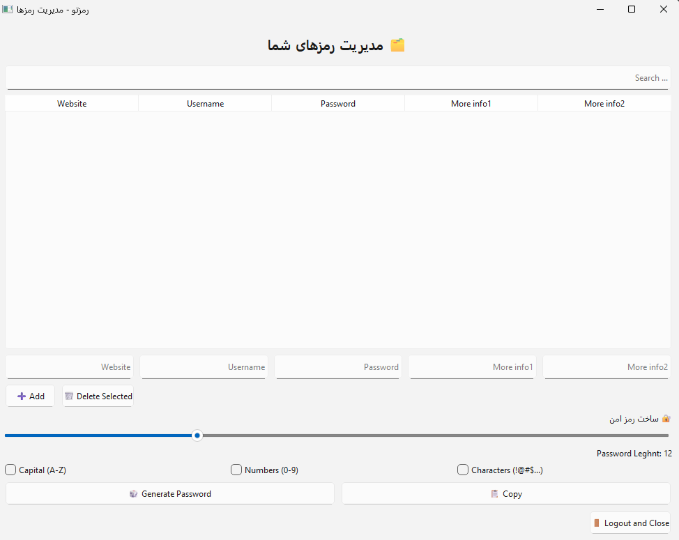

# 🔐 رمزتو | Ramzeto

**رمزتو** یک برنامه ساده و کاربردی برای مدیریت رمزهای عبور شخصی است که با استفاده از Python و کتابخانه‌ی PySide6 ساخته شده. این برنامه امکان ذخیره، جستجو، و تولید رمزهای امن را فراهم می‌کند و محیطی کاملاً فارسی و کاربرپسند دارد.

---

## ✨ امکانات برنامه

- ✅ ذخیره‌ی اطلاعات سایت، نام کاربری، رمز و یادداشت‌های دلخواه
- 🔍 جستجوی سریع رمزها بر اساس نام سایت
- 🗂 نمایش جدول کامل اطلاعات ذخیره‌شده
- 🧮 تولید رمز عبور امن با انتخاب ویژگی‌های دلخواه (اعداد، حروف بزرگ، نمادها)
- 📋 کپی سریع رمز تولیدشده به کلیپ‌بورد
- 💾 ذخیره‌سازی خودکار اطلاعات رمزها به‌صورت دائمی
- 🌐 پشتیبانی کامل از زبان فارسی و رابط راست‌چین

---

## 📷 نمایی از برنامه

  
*رابط کاربری ساده و فارسی*

---

## 🚀 اجرای برنامه

برای اجرای پروژه، ابتدا مطمئن شوید Python نصب شده و سپس مراحل زیر را طی کنید:

```bash
# ایجاد محیط مجازی (اختیاری ولی پیشنهادشده)
python -m venv venv
source venv/bin/activate  # در ویندوز: venv\Scripts\activate

# نصب وابستگی‌ها
pip install -r requirements.txt

# اجرای برنامه
python main.py
